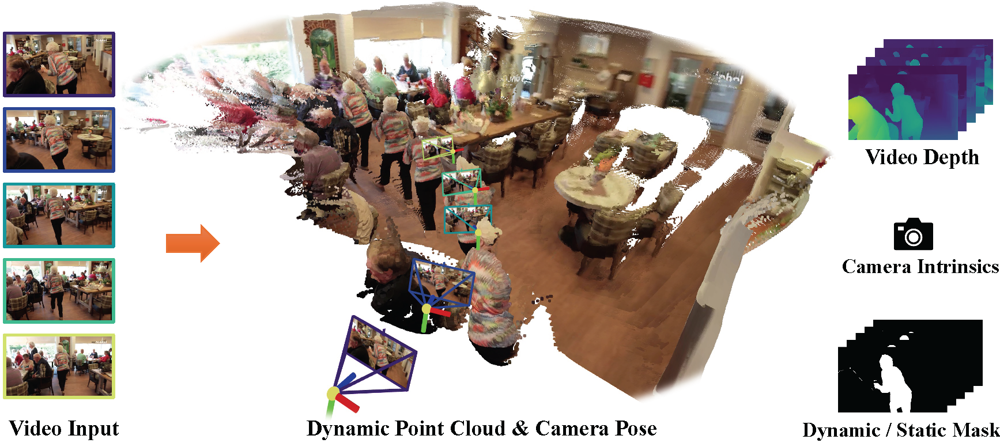

# MonST3R: A Simple Approach for Estimating Geometry in the Presence of Motion

**MonST3R**  processes a dynamic video to produce a time-varying dynamic point cloud, along with per-frame camera poses and intrinsics, in a predominantly **feed-forward** manner. This representation then enables the efficient computation of downstream tasks, such as video depth estimation and dynamic/static scene segmentation.

This repository is the official implementation of the paper:

[**MonST3R: A Simple Approach for Estimating Geometry in the Presence of Motion**](https://monst3r-project.github.io/files/monst3r_paper.pdf)
[*Junyi Zhang*](https://junyi42.github.io/),
[*Charles Herrmann+*](https://scholar.google.com/citations?user=LQvi5XAAAAAJ),
[*Junhwa Hur*](https://hurjunhwa.github.io/),
[*Varun Jampani*](https://varunjampani.github.io/),
[*Trevor Darrell*](https://people.eecs.berkeley.edu/~trevor/),
[*Forrester Cole*](https://scholar.google.com/citations?user=xZRRr-IAAAAJ&hl),
[*Deqing Sun**](https://deqings.github.io/),
[*Ming-Hsuan Yang**](https://faculty.ucmerced.edu/mhyang/)
Arxiv, 2024. [**[Project Page]**](https://monst3r-project.github.io/) [**[Paper]**](https://monst3r-project.github.io/files/monst3r_paper.pdf) [**[Interative Results🔥]**](https://monst3r-project.github.io/page1.html) 

[](https://monst3r-project.github.io/files/teaser_vid_v2_lowres.mp4)

## TODO
- [x] Release model weights on [Google Drive](https://drive.google.com/file/d/1Z1jO_JmfZj0z3bgMvCwqfUhyZ1bIbc9E/view?usp=sharing)
- [x] Release inference code for global optimization (10/18)
- [x] Release 4D visualization code (10/18)
- [ ] Release evaluation code (est. time: 10/21)
- [ ] Release training code & dataset preparation (est. time: 10/21)
- [ ] Gradio Demo (est. time: 10/28)

## Getting Started

### Installation

1. Clone MonST3R.
```bash
git clone --recursive https://github.com/junyi42/monst3r
cd monst3r
## if you have already cloned monst3r:
# git clone https://github.com/junyi42/viser viser
# git clone https://github.com/junyi42/croco croco
```

2. Create the environment, here we show an example using conda.
```bash
conda create -n monst3r python=3.11 cmake=3.14.0
conda activate monst3r 
conda install pytorch torchvision pytorch-cuda=12.1 -c pytorch -c nvidia  # use the correct version of cuda for your system
pip install -r requirements.txt
# Optional: you can also install additional packages to:
# - training
# - evaluation on camera pose
# - dataset preparation
pip install -r requirements_optional.txt
```

3. Optional, install 4d visualization tool, `viser`.
```bash
pip install -e viser
```

4. Optional, compile the cuda kernels for RoPE (as in CroCo v2).
```bash
# DUST3R relies on RoPE positional embeddings for which you can compile some cuda kernels for faster runtime.
cd croco/models/curope/
python setup.py build_ext --inplace
cd ../../../
```

### Download Checkpoints

We currently provide fine-tuned model weights for MonST3R, which can be downloaded on [Google Drive](https://drive.google.com/file/d/1Z1jO_JmfZj0z3bgMvCwqfUhyZ1bIbc9E/view?usp=sharing) and [Hugging Face](https://huggingface.co/Junyi42/MonST3R_PO-TA-S-W_ViTLarge_BaseDecoder_512_dpt).


To download the weights of MonST3R and optical flow models, run the following commands:
```bash
# download the weights
cd data
bash download_ckpt.sh
cd ..
```

### Inference

To run the inference code, you can use the following command:
```bash
python demo.py # launch GUI, input can be a folder or a video
```

The results will be saved in the `demo_tmp/{Sequence Name}` (by default is `demo_tmp/NULL`) folder for future visualization.

You can also run the inference code in a non-interactive mode:
```bash
python demo.py --input demo_data/lady-running --output_dir demo_tmp --seq_name lady-running
# use video as input: --input demo_data/lady-running.mp4 --num_frames 65
```

> Currently, it takes about 33G VRAM to run the inference code on a 16:9 video of 65 frames. Use less frames or disable the `flow_loss` could reduce the memory usage. We are **welcome to any PRs** to improve the memory efficiency (one reasonable way is to implement window-wise optimzation in `optimizer.py`).

### Visualization

To visualize the interactive 4D results, you can use the following command:
```bash
python viser/visualizer_monst3r.py --data demo_tmp/lady-running
# to remove the floaters of foreground: --init_conf --fg_conf_thre 1.0 (thre can be adjusted)
```

## Citation

If you find our work useful, please cite:

```bibtex
@article{zhang2024monst3r,
  author    = {Zhang, Junyi and Herrmann, Charles and Hur, Junhwa and Jampani, Varun and Darrell, Trevor and Cole, Forrester and Sun, Deqing and Yang, Ming-Hsuan},
  title     = {MonST3R: A Simple Approach for Estimating Geometry in the Presence of Motion},
  journal   = {arXiv preprint arxiv:2410.03825},
  year      = {2024}
}
```

## Acknowledgements
Our code is based on [DUSt3R](https://github.com/naver/dust3r) and [CasualSAM](https://github.com/ztzhang/casualSAM), our camera pose estimation evaluation script is based on [LEAP-VO](https://github.com/chiaki530/leapvo), and our visualization code is based on [Viser](https://github.com/nerfstudio-project/viser). We thank the authors for their excellent work!
